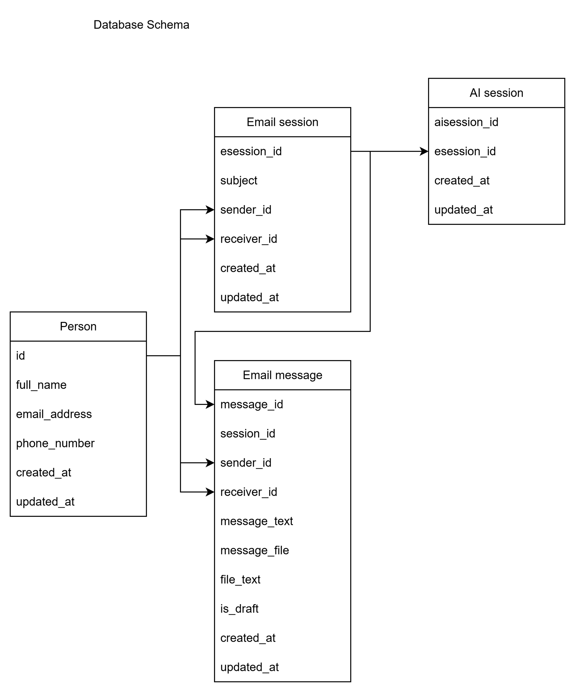
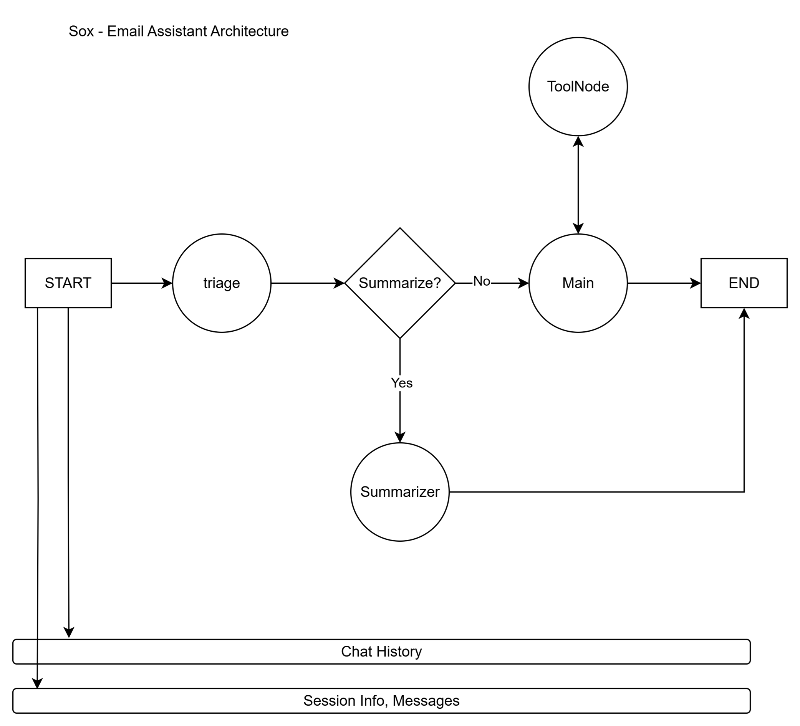

# Email-Assistant-Agent
Sox - a personal assistant AI agent to help with email intelligence

## Project Structure

```
Email-Assistant-Agent/
├── email_assistant/         # Main package
│   ├── backend/             # Backend logic and endpoints
│   │   ├── api/             # FastAPI endpoints
│   │   │   ├── esession_routes.py
│   │   │   ├── aisession_routes.py
│   │   │   └── person_routes.py
│   │   ├── services/        # Business logic services
│   │   │   ├── esession_service.py
│   │   │   ├── aisession_service.py
│   │   │   └── person_service.py
│   │   ├── models/          # Data models
│   │   │   ├── esession_models.py
│   │   │   ├── aisession_models.py
│   │   │   └── person_models.py
│   │   ├── database/        # Database configuration and models
│   │   │   ├── config.py    # Database connection
│   │   │   ├── models.py    # SQLAlchemy models
│   │   │   ├── repositories.py # Data access layer
│   │   │   ├── session_service_db.py    # Email Session Database connection
│   │   │   ├── aisession_service_db.py    # AI Session Database connection
│   │   │   ├── person_service_db.py    # Database connection
│   │   │   └── init_db.py   # Database initialization
│   │   ├── engine/          # AI engine (LLM + LangGraph)
│   │   │   ├── llm/         # LLM providers
│   │   │   │   ├── base.py  # Base LLM interface
│   │   │   │   ├── aws_llm.py 
│   │   │   │   └── gcp_llm.py # Not implemented yet
│   │   │   ├── agents/      # AI agents
│   │   │   │   ├── sox_agent.py
│   │   │   │   ├── sox_chat.py
│   │   │   │   └── prompts.py
│   │   │   └── utils/       # Utilities 
│   │   │       └── pdf_parser.py 
│   │   └── main.py          # FastAPI application
│   ├── cli/                 # CLI interface
│   │   ├── cli.py           # Main CLI logic
│   │   ├── backends.py      # Backend factory
│   │   ├── base.py      # Base Backend
│   │   └── fastapi_backend.py # FastAPI HTTP client
│   ├── __init__.py          # Package initializer
│   └── __main__.py          # Module entry point
├── run_server.py            # Server startup script
├── init_database.py         # Database initialization script
└── requirements.txt         # Python dependencies
```

## Architecture

### **CLI Layer** (`email_assistant/cli/`)
- **Command Interface**: User-friendly command-line interface
- **Backend Adapters**: Pluggable backend implementations
- **Same Core**: Uses identical core functions as backend

### **Backend Layer** (`email_assistant/backend/`)
- **API Routes**: FastAPI endpoints for session management
- **Services**: Business logic that calls core functions
- **Database**: SQLAlchemy models and repositories for data persistence
- **Engine**: AI processing with LangGraph and LLM integration

### **Unified Design**
- **Single Package**: All functionality is contained within `email_assistant` package
- **Shared Core**: Both CLI and backend use the same core functions
- **Clean Separation**: Backend endpoints and CLI commands use identical business logic

## Project Logic 

### What is Email Session? 

While using email, we see you and other person are replying each other over one subject. I want to model this conversation on email and try to bring intelligence for management. So Email Session contains `session_id`, `sender_id` (who initially started the conversation), `receiver_id`, `subject` (the topic of conversation the sender set). I didn't integrate email api but it is fully operable and expressive enough for compatibility. 

### What is AI Session? 

The user will ask intelligence over a certain email session. He/She can ask arbitrary questions like below. 
- Could you write a reply for me?
- Could you summarize the overall conversation? 


## Quickstart

### 1. Install Dependencies

```bash
pip install -r requirements.txt
```

### 2. Initialize Database

```bash
# Initialize database with tables and sample data
python init_database.py
```

This will create:
- `email_assistant.db` SQLite database file
- Tables for sessions, messages, and persons
- Sample data for testing

### 3. Environment Variables

You need to add your email in `email_assistant.db` and its path in .env
```bash
SELF_USER_EMAIL=john.doe@example.com
DATABASE_URL=sqlite:///./email_assistant.db
```

Also add AWS credentials such as `AWS_REGION`, `AWS_ACCESS_KEY_ID`, `AWS_SECRET_ACCESS_KEY`, and `AWS_SESSION_TOKEN`. 

### 4. Start the FastAPI Server

```bash
# Option 1: Using the startup script
python run_server.py

# Option 2: Using uvicorn directly
uvicorn email_assistant.backend.main:app --host 0.0.0.0 --port 8000 --reload
```

The server will be available at `http://localhost:8000`

### 5. Use the CLI

```bash
# From the repository root
python -m email_assistant help
python -m email_assistant 
python -m email_assistant session_create --sender_id <sender_id> --receiver_id <receiver_id> --subject <subject>  
python -m email_assistant session_chat --session_id <session_id> --content "Hello, how are you?"
python -m email_assistant aisession_create --esession_id <esession_id> 
```

### 6. Available Commands

1. **help** - Show help message with all available commands
2. **session_create** - Create a new email session and return session ID
3. **session_delete --session_id <id>** - Delete an email session with given ID
4. **session_edit --session_id <id> --element_id <msg_id> --content <content>** - Edit message in email session
5. **session_chat --session_id <id> --sender_id <sender_id> --receiver_id <receiver_id> --message_text <message_text> [--file_path <file_path>]** - Add message of an email session
6. **aisession_create --esession_id <esession_id>** - Create a new AI session on email session
7. **chat_with_sox --aisession_id <aisession_id> --message <message> --context <context>** - Chat with sox

### Examples

```bash
# Create a new session
python -m email_assistant session_create

# Chat with the assistant (replace abc123 with actual session ID)
python -m email_assistant session_chat --session_id abc123 --content "Hello, can you help me draft an email?"

# Edit a message in the session
python -m email_assistant session_edit --session_id abc123 --element_id 1 --content "Updated message content"

# Delete the session
python -m email_assistant session_delete --session_id abc123
```

### API Documentation

Once the server is running, you can access:
- **Health check**: http://localhost:8000/health

## Database Schema

### **Core Entities**

1. **Person** - Message sender and receiver
   - `id`: UUID primary key
   - `full_name`: Full name
   - `email_address`: Email address
   - `phone_number`: Phone number

2. **Email Session** - Email conversation session
   - `id`: UUID primary key
   - `subject`: Session subject text
   - `sender_id`: Foreign key to Person (sender)
   - `receiver_id`: Foreign key to Person (receiver)
   - `created_at`: Creation timestamp
   - `updated_at`: Last update timestamp

3. **Message** - Individual messages within a session
   - `id`: UUID primary key
   - `esession_id`: Foreign key to Email Session
   - `sender_id`: Foreign key to Person (sender)
   - `receiver_id`: Foreign key to Person (receiver)
   - `message_text`: Message content
   - `message_file`: Attached file path 
   - `file_text`: File content parsed from file
   - `is_draft`: Draft email or not
   - `created_at`: Creation timestamp

4. **AI Session** - AI session (Sox chat) 
   - `id`: UUID primary key 
   - `esession_id`: Foreign key to Email Session
   - `created_at`: Creation timestamp
   - `updated_at`: Last update timestamp

### **Relationships**
- One Session has many Messages
- One Person can be sender/receiver of many Messages
- Cascade deletes ensure data integrity

## Key Benefits

1. **Unified Architecture**: CLI and backend use identical core functions
2. **Single Source of Truth**: All business logic is in one place
3. **Persistent Storage**: SQLite database for session and message persistence
4. **Easy Testing**: Core functions can be tested independently
5. **Consistent Behavior**: CLI and API behave identically
6. **Scalable**: Easy to add new LLM providers and workflows

## LLM choice reasoning 

For an email-assistant agent, we want a conversational model with strong context and safety. Two leading enterprise options are Amazon Bedrock (AWS) amd Google Vertex AI (GCP):

- AWS (Amazon Bedrock with Anthropic Claude) - Bedrock lets you use state-of-the-art chat models like Claude 3 Haiku/Sonnet. Claude excels at dialogue, summarization and extracting structured info (from emails). It supports very long contexts (up to 200K+ tokens) so it can handle entire email threads. Bedrock is also serverless and enterprise-grade (AWS identity/credentials) and integrates easily via `langchain-aws` library. 

- GCP (Vertex AI with Google Gemini) - Vertex offers Google's latest Gemini 2.5 chat models which are multimodal and excel at content generation, summarization and extraction. Google explicitly cites summarization, classification and structured extraction as common tasks for Gemini. Vertex AI also provides enterprise security. 

Each platform has LangChain integration (`ChatBedrock` for AWS, `ChatVertexAI` for GCP). I don't have enough time so I will implement the cases only for AWS Bedrock LLMs. 


## Architecture Diagram 
**Database Schema**
 

**Sox Architecture**


## Necessary Files 
You can access diagram file here: [resources/files/sox_diagram.drawio](resources/files/sox_diagram.drawio)

You can access postman checkpoint here: [resources/files/sox.postman_collection.json](resources/files/sox.postman_collection.json)

If you have any questions, please let me know. 
[Tatrab Labs](mailto:tatra.labs@gmail.com)